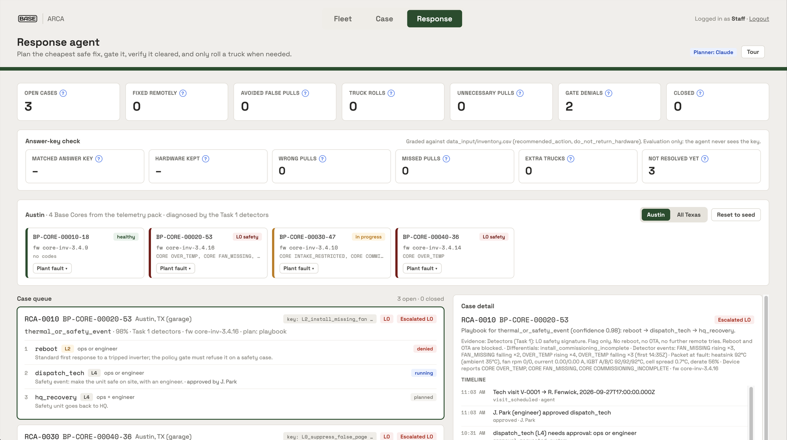

# ercot-mcp

An MCP (Model Context Protocol) server that gives an LLM agent tools to pull live and historical data from [ERCOT's Public API](https://developer.ercot.com/) — prices, load, generation, congestion, outages, and more.

Built for **Track 1 — Open Grid Data** at the [Base Power & AITX Talent Hackathon](https://common-scooter-829.notion.site/Base-AITX-Talent-Hackathon-3e01e636288e80a7b914c993f90ae6c5).

## ARCA: how it fits together

**Demo video:** [docs/demo/arca-demo.mp4](docs/demo/arca-demo.mp4)



*The `/response` page (Austin view): fleet tiles, the answer-key check, and a case where the gate blocks a remote reboot on a safety signature and the agent dispatches a tech instead.*

ARCA (Automatic Root Cause Analysis) takes a faulted Base Core from "something's wrong" to "fixed, and proven fixed", and only rolls a truck or pulls hardware when it has to.

```
data_input/ telemetry pack ──► Task 1 detectors ──► Response engine ──► pages
 (48 Cores, events, packets)    (diagnosis)          (plan → policy gate → approve
                                                      → run → verify → escalate)
```

- **One fleet:** the 48 real inventory Cores in `data_input/` (synthetic, shaped like Base's hardware). Austin / All Texas is a view filter, not a separate fleet.
- **One engine:** `src/response/routes.ts` builds a single `DefaultResponseEngine`. `/fleet`, `/case`, `/technician` and `/response` all read it, so a case number means the same case everywhere.
- **One diagnosis:** the Task 1 detectors (`src/field-rca/detectors`) run on each unit's packet (`src/response/detector-hypothesis.ts`).
- **Scoring:** `/response` grades outcomes against the pack's answer key (`inventory.csv` `recommended_action`, `do_not_return_hardware`). The agent never sees the key.

| Area | Code | Built by |
|---|---|---|
| Telemetry pack, detectors, triage, field-rca contracts | `data_input/`, `src/field-rca/` | Megan |
| Response engine, planner (Claude or playbook), policy gate, verifier, scheduler, fleet sim, scorecard, `/response` | `src/response/`, `src/sim/`, `src/pages/response-page.ts` | Carlos |
| Login and roles, `/fleet`, `/case`, `/technician`, dashboard server | `src/pages/`, `src/session-store.ts`, `src/dashboard-server.ts` | Maria |

Run it: `npm install && npm run dashboard`, open http://localhost:4173 and log in as `staffAustin` / `basehq2026` (or `tech` / `basehq2026`). Add `ANTHROPIC_API_KEY` to `.env` to switch the planner from the playbook to Claude.

**Known duplication (next steps):** there are two policy gates and playbooks. `src/response/` enforces approvals while fixes run; `src/field-rca/` recommends an action from a diagnosis. Merge them and align the action names. `/api/response-austin/*` and `austin:` case links are kept only as aliases. The 12-unit demo fleet (`data/sim-fleet.seed.json`) and the 9 detector fixtures remain in tests only.

The ERCOT MCP server below is the team's earlier grid-data tool.


## 1. Register for an ERCOT Public API key (one-time, manual)

ERCOT requires email verification, so this step has to be done by a human in a browser — it can't be scripted.

1. Go to the [ERCOT API Explorer](https://apiexplorer.ercot.com/) and click **Sign In/Sign Up**.
2. Enter your email, retrieve the verification code from your inbox, and enter it.
3. Set a password and your name to finish creating the account.
4. Once signed in, go to **Products** in the top nav, select **Public API**, give the subscription a name (e.g. `Public API`), and click **Subscribe**.
5. On your **Profile** page, click **Show** next to the new subscription and copy the **Primary key** — this is your `ERCOT_SUBSCRIPTION_KEY`.

Full details: [Registration and Authentication docs](https://developer.ercot.com/applications/pubapi/user-guide/registration-and-authentication/).

## 2. Configure credentials

```bash
npm install
cp .env.example .env
```

Fill in `.env`:

```
ERCOT_USERNAME=you@example.com          # the email you registered with
ERCOT_PASSWORD=your-account-password
ERCOT_SUBSCRIPTION_KEY=your-primary-key
```

The server exchanges your username/password for a short-lived (1 hour) ID token on demand and caches it in memory — there's no separate "API key" beyond the subscription key plus your account credentials.

## 3. Build and run

```bash
npm run build
npm start
```

This runs the MCP server over stdio.

## 4. Connect it to Claude Code / Claude Desktop

Add to your MCP config (e.g. `.mcp.json` in this repo, or Claude Desktop's config):

```json
{
  "mcpServers": {
    "ercot": {
      "command": "node",
      "args": ["/absolute/path/to/base-hackathon/dist/index.js"],
      "env": {
        "ERCOT_USERNAME": "you@example.com",
        "ERCOT_PASSWORD": "your-account-password",
        "ERCOT_SUBSCRIPTION_KEY": "your-primary-key"
      }
    }
  }
}
```

## Tools

| Tool | Purpose |
|---|---|
| `list_products` | List ERCOT EMIL products (report categories) with pagination and name search |
| `get_product` | Get one product's metadata and its report endpoints, by `emilId` |
| `get_report_data` | Fetch actual data rows from a report artifact, with arbitrary query params (date filters, paging) |
| `get_archive` | List historical archive files for a product beyond the live report window |
| `raw_get` | Escape hatch: authenticated GET against any ERCOT Public API URL/path |

Typical flow: `list_products` (search e.g. "LMP" or "load") → `get_product` for the `emilId` you want → `get_report_data` with that product's report path segment and any date filters.

## Notes

- ERCOT's `Coming Soon` docs mean per-report query parameters (date filters, etc.) aren't uniformly documented — `get_product` returns each report's endpoint URL, and `get_report_data`/`raw_get` pass through any query params you give them.
- Report and data field names vary per EMIL product; ERCOT's [data product catalog](https://www.ercot.com/mp/data-products) is useful for figuring out what a given `emilId` contains.
