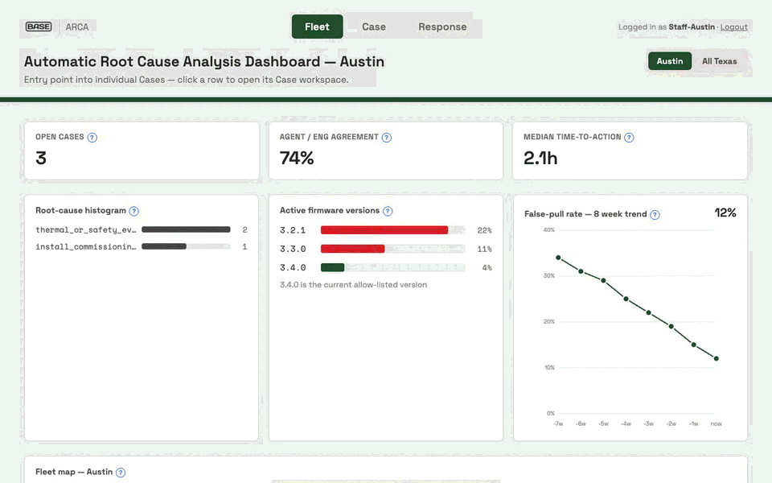

# ARCA: Automatic Root Cause Analysis for a home-battery fleet

ARCA takes a faulted home battery from "something's wrong" to "fixed, and proven fixed". It tries the cheapest safe fix first, checks whether that fix worked, and only sends a technician or pulls hardware when it has to.

Built in 48 hours by a team of three at the **Base Power × AITX Talent Hackathon** (Austin, Sep 2026). Base engineers judged it.

**Live demo:** [arca-demo.onrender.com](https://arca-demo.onrender.com) (one-click demo login; the free host may take ~30 s to wake up) · **Video:** [docs/demo/arca-demo.mp4](docs/demo/arca-demo.mp4)



*A thermal safety case in Austin: the gate denied the remote reboot (L0, no remote actuation), so the agent's next step is a technician. One approval schedules the visit, and every decision lands on the case timeline.*

> Hackathon project, not a Base product. All fleet data is a synthetic telemetry pack shaped like Base's hardware. Device actions run against a simulator, not real batteries.

## The problem

A distributed battery fleet throws off a constant stream of faults. Most are cheap to fix remotely, a few are dangerous, and some are false alarms. If every fault gets a truck roll, you waste money and pull healthy hardware. If faults get ignored, the dangerous ones get worse. The goal: **don't pull a healthy unit, and never "try one more thing" on a unit that's unsafe.**

## How it works

```
telemetry pack ──► detectors ──► planner ──► policy gate ──► approve ──► run ──► verify
(48 Cores, events,  (root cause,   (Claude or    (deterministic   (role-based   (sim)   (re-read device:
 packets at fault)   confidence)    playbook)     code, not LLM)   buttons)              cleared? escalate?)
                                                                                           │
                                         tech visit (checklist, photos) ◄── dispatch ◄─────┘
```

1. **Detect.** Deterministic detectors read each unit's telemetry packet and classify the fault into a closed set of root causes (firmware soft fault, version mismatch, CAN link, install or wiring error, thermal or safety event, hardware defect, and so on), each with a confidence score.
2. **Plan.** The planner proposes a gameplan built only from a fixed action catalog (monitor, log dump, reboot, OTA to an allow-listed firmware, dispatch a tech, HQ recovery), cheapest and safest first. When `ANTHROPIC_API_KEY` is set it uses Claude tool use with a schema that can't express actions outside the catalog. Otherwise it falls back to a playbook.
3. **Gate.** A deterministic policy gate, not the model, decides whether each step can run and who has to approve it:
   - Safety (L0) cases get **no remote actuation**. The simulator refuses too, as a second layer of defense.
   - Only an engineer can approve an OTA, and only to an allow-listed version.
   - HQ recovery needs two different people (ops and engineering), plus on-site confirmation first.
   - Unknown or low-confidence diagnoses block remote actions.
4. **Run and verify.** Approved actions go to the fleet simulator, and then the verifier reads the device status again. If the fault cleared, the case goes to an engineer to close. If it didn't, the next step runs or the case escalates and gets re-planned.
5. **Dispatch.** Physical work is scheduled to a named technician with a slot, a brief, and a checklist. Some visits require photos before they can be marked complete.
6. **Audit.** Every diagnosis, gate decision, approval, and outcome lands on the case timeline. When three or more units on the same firmware fail the same way, the agent drafts an engineer bug report.

## Results

The telemetry pack includes an answer key (the recommended action per unit). The agent never sees it. With every step approved, the end-to-end test grades the outcomes against it (`src/response/core-pack.test.ts`):

| Metric | Result |
|---|---|
| Cases graded | 47 |
| Outcome matches answer key | 40 |
| Wrong hardware pulls | **0** |
| Missed pulls | 0 |
| "Do not return" units kept in the field | 40 / 40 |
| Extra truck rolls | 7 |

All 7 extra truck rolls trace back to diagnosis, and the gate behaved as designed in each one. Five false alarms were flagged as safety events, so the gate required a person on site. Two gateway outages came back as `unknown`, which blocks remote actions.

## Try it

**Hosted:** open [arca-demo.onrender.com](https://arca-demo.onrender.com) and click **Ops staff view** or **Technician view**.

**Locally** (Node 20+, no API keys needed):

```bash
npm install
npm run dashboard        # http://localhost:4173
npm test                 # 147 tests
```

Suggested walkthrough: on `/response`, open a safety case and see the reboot denied with its reason. Then approve a dispatch step, log in as the technician, complete the visit, and watch the case close. **Reset to seed** puts everything back.

Optional: add `ANTHROPIC_API_KEY` to `.env` to switch the planner from the playbook to Claude.

## Team and my role

| Area | Code | Built by |
|---|---|---|
| Response engine: planner, policy gate, runner and verifier, escalation, scheduler, bug reports, fleet simulator, answer-key scorecard, `/response` page | `src/response/`, `src/sim/`, `src/pages/response-page.ts` | **Carlos Rojas** |
| Telemetry pack, detectors, triage, field-RCA contracts | `data_input/`, `src/field-rca/` | Megan Zhong |
| Login and roles, `/fleet`, `/case`, `/technician`, dashboard server | `src/pages/`, `src/session-store.ts`, `src/dashboard-server.ts` | Maria Cruz |

Design doc for my part: [docs/field-rca/response-agent.md](docs/field-rca/response-agent.md).

## Design decisions

- **The gate is code, not the model.** An LLM can propose, but ~130 lines of deterministic, tested TypeScript (`src/response/policy-gate.ts`) decide what's allowed. The engine also re-derives each step's level and required approvals from the catalog, ignoring anything the model claims.
- **The AI never writes firmware.** OTA can only target versions on an allow-list.
- **Defense in depth on safety.** The gate denies remote actions on L0 cases, and the simulator independently refuses them.
- **No framework.** A plain `node:http` server and server-rendered pages, so the whole system reads top to bottom.

## Stack

TypeScript on Node · plain `node:http` · Anthropic SDK (optional planner) · `node:test` (147 tests) · no database: case state is persisted to JSON files.

## Also in this repo

- [`ercot-mcp`](docs/ercot-mcp.md): an MCP server that exposes the ERCOT Public API (Texas grid prices, load, generation) as LLM tools. The team's earlier grid-data tool.
- [`docs/hackathon/`](docs/hackathon/): the original submission write-up, demo script, and team notes.

## Known limitations

- Device actuation is simulated. There's no real hardware behind the reboot and OTA buttons.
- There are two policy-gate and playbook implementations (`src/response/` enforces approvals at run time, and `src/field-rca/` recommends from a diagnosis). They should be merged.
- Auth is two hard-coded demo accounts with in-memory sessions. All visitors to the hosted demo share one fleet state.

License: MIT, as declared in `package.json`.
